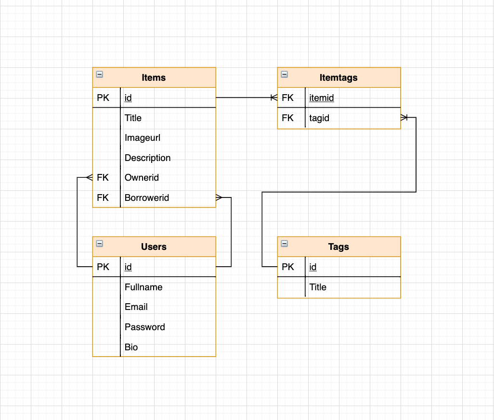
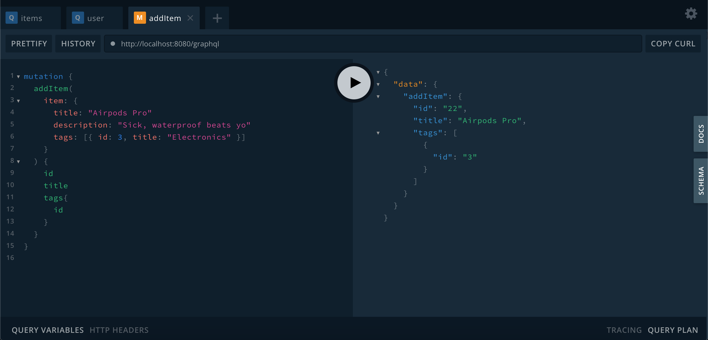

# Boomtown 🏙

This is a back-end application to support a mock local sharing economy. The app uses [PostgreSQL](https://www.postgresql.org/) as a relational database to store shareable items and user info, [Node.js](https://nodejs.org/en/)/[Express](https://expressjs.com/) as its web server, and [GraphQL](https://graphql.org/) for its client-facing API.

## Installation Instructions

Follow the instructions below to run the application in on your local device.

## Server

Commands must be run from the `server` directory:

### Installation

```bash
yarn install
```

### Run

```bash
yarn run start:dev
```

## Client

Commands must be run from the `client` directory:

### Installation

```bash
yarn install
```

### Run

```bash
yarn start
```

### Build

```bash
yarn run build
```

## Physical Schema

This application is built with a relational database - PostgreSQL - that contains four tables - Items, Tags, Itemtags, and Users. Itemtags is a 'Many to Many' intersecting table, referencing both Items and Tags by their respective ID's. A relational database is usefull in this context because of several factors:

- We have a small database - normalization reduces redundancies and the relationships are not complex
- Our transactions and queries will execute quickly because of the simplicity of the relational connections



## Technologies Used

### PostgreSQL

- A Relational Database Query Language

```
 SELECT {Your column names here OR * for all columns} FROM {Your table name here};
 WHERE {Your conditions here}
```

A basic query example from [GraphQL](https://graphql.org/graphql-js/)

### Node.js

- A JavaScript based, open-source server environment

```
const http = require('http');

const hostname = '127.0.0.1';
const port = 3000;

const server = http.createServer((req, res) => {
  res.statusCode = 200;
  res.setHeader('Content-Type', 'text/plain');
  res.end('Hello World');
});

server.listen(port, hostname, () => {
  console.log(`Server running at http://${hostname}:${port}/`);
});
```

Lisenting to a basic Node.js server from [Node.js](https://nodejs.org/en/docs/guides/getting-started-guide/)

### Express

- Express is a minimal and flexible Node.js web application framework

```
const express = require('express')
const app = express()
const port = {Your port number here eg. 3000}

app.get('/', (req, res) => res.send('Hello World!'))

app.listen(port, () => console.log(`Example app listening on port ${port}!`))
```

A basic Express app from [Express](https://expressjs.com/en/starter/hello-world.html)

### GraphQL

- A more direct query language to access data in an API

```
npm init
npm install graphql --save
```

```var { graphql, buildSchema } = require('graphql');

// Construct a schema, using GraphQL schema language
var schema = buildSchema(`
  type Query {
    hello: String
  }
`);

// The root provides a resolver function for each API endpoint
var root = {
  hello: () => {
    return 'Hello world!';
  },
};

// Run the GraphQL query '{ hello }' and print out the response
graphql(schema, '{ hello }', root).then((response) => {
  console.log(response);
});
```

A basic schema and query using GraphQL from [Graphql's](https://graphql.org/graphql-js/) website


`GraphQl Playground`

## Personal Learnings

I learned the advantages of using Node.js, and open-source and cross-platform JavaScript runtime environment, to build a full-stack app. Being able to use JavaScript on both the front and back-end has plenty of advantages, most importantly for me, using one language for multiple purposes. It also uses Googles V8 JavaScript engine to compile code, making implementing code faster and easier than ever. Node.js also has a huge, supportive, and active community that is alwasy working towards improving Node.js itself

I learned the benefits of using GraphQL to access data via an API vs REST. With an eloquent schema, queries can easily and quickly avoid over/under fetching data, making client queries very efficient.

I learned that Express.js is an excellent framework for building a web application quickly and efficiently.

I learned that PostgreSQL can be created, altered, or otherwise manipulated with both Terminal using the code `psql` or using a GUI like [Postico](https://eggerapps.at/postico/) or [pgAdmin](https://www.pgadmin.org/download/).
